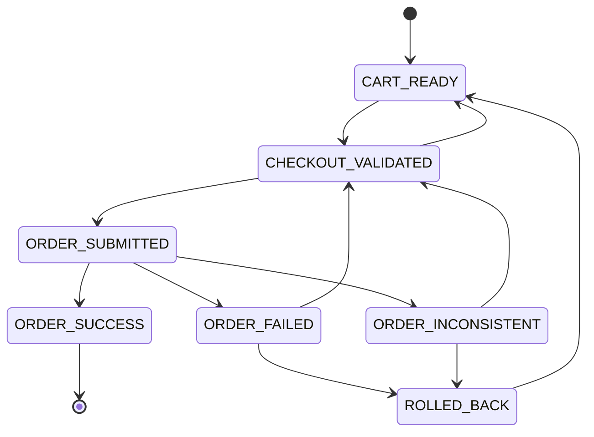
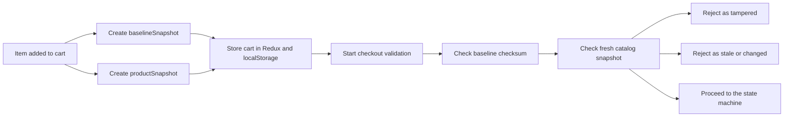
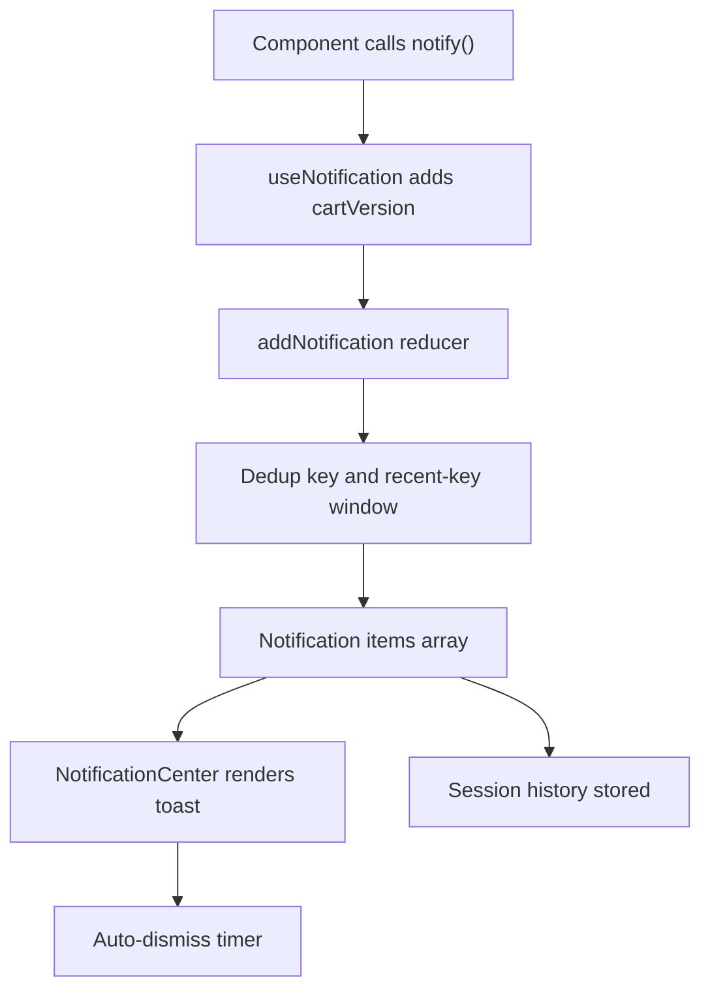

# Frontend Task 

## 1. Architecture Write-up: Data Flow + State Machine

### 1.1 High-level data flow

### 1.2 Flow table

| Stage | Source file | Key action | Output |
|---|---|---|---|
| App bootstrap | `src/pages/Home.jsx` | Dispatches `initializeCart()` and `loadOrderHistory()` | Rehydrated cart and order history |
| Product fetch | `src/pages/Products.jsx` + `src/features/productSlice.js` | Fetches products/categories, applies filters, virtualizes grid | Large browsable catalog |
| Cart mutation | `src/features/cartSlice.js` | Adds, updates, removes, and persists cart items | Updated Redux cart + `localStorage` |
| Checkout validation | `src/features/checkoutSlice.js` + `src/services/cartValidator.js` | Validates empty cart, item shape, tampering, and catalog freshness | `CHECKOUT_VALIDATED` or failure |
| State transition | `src/services/stateMachine.js` | Enforces allowed order states | Deterministic workflow history |
| Order persistence | `src/features/checkoutSlice.js` + `src/services/storageService.js` | Writes order data into history storage | Order history page data |
| Notifications | `src/components/NotificationCenter.jsx` + `src/features/notificationSlice.js` | Dedupes and auto-dismisses alerts | Visible UI feedback + session history |

### 1.3 State machine overview

### 1.4 State transition table

| From | To | Why it happens | Where it is enforced |
|---|---|---|---|
| `CART_READY` | `CHECKOUT_VALIDATED` | Cart passes validation | `validateCheckout.fulfilled` in `checkoutSlice.js` |
| `CHECKOUT_VALIDATED` | `ORDER_SUBMITTED` | Submission begins | `submitOrder.pending` in `checkoutSlice.js` |
| `ORDER_SUBMITTED` | `ORDER_SUCCESS` | Order accepted and persisted | `submitOrder.fulfilled` in `checkoutSlice.js` |
| `ORDER_SUBMITTED` | `ORDER_FAILED` | Submission fails | `submitOrder.rejected` in `checkoutSlice.js` |
| `ORDER_SUBMITTED` | `ORDER_INCONSISTENT` | Persistence or data mismatch | `submitOrder.rejected` with `inconsistent: true` |
| `ORDER_FAILED` | `CHECKOUT_VALIDATED` | User retries after fixes | `transitionState` / retry flow |
| `ORDER_FAILED` | `ROLLED_BACK` | User chooses rollback | `rollbackOrder` in `checkoutSlice.js` |
| `ORDER_INCONSISTENT` | `ROLLED_BACK` | User chooses rollback | `rollbackOrder` / recovery path |
| `ROLLED_BACK` | `CART_READY` | Return to safe state | `rollbackToCartReady` in `checkoutSlice.js` |

### 1.5 Detailed component responsibilities

| Module | Responsibility | Key exports / UI impact |
|---|---|---|
| `src/features/productSlice.js` | Fetches and filters product catalog | `fetchProducts`, `fetchCategories`, `selectFilteredProducts` |
| `src/features/cartSlice.js` | Manages cart items, versioning, snapshots, persistence | `initializeCart`, `addItemToCart`, `syncCartFromStorage` |
| `src/features/checkoutSlice.js` | Validates checkout and runs order lifecycle | `validateCheckout`, `submitOrder`, state reducers |
| `src/services/cartValidator.js` | Tamper checks and catalog freshness checks | `verifyPriceIntegrity`, `verifyFreshCatalogConsistency` |
| `src/services/stateMachine.js` | Prevents illegal transitions | `transition`, `subscribe`, `notifyListeners` |
| `src/components/NotificationCenter.jsx` | Shows live toasts and history | Session-backed notification UI |
| `src/pages/Checkout.jsx` | Lightweight validation screen | Summary, validation button, state machine visualization |

## 2. Edge Case Matrix

| Edge case | Trigger | Current behavior | User-facing result | Risk level |
|---|---|---|---|---|
| Empty cart on checkout | Navigate to checkout with no items | Redirects back to cart | User cannot validate an empty order | Low |
| Invalid cart state vs storage | Redux cart and `localStorage` differ | `validateCheckout` rejects with mismatch reason | Validation fails with tamper warning | High |
| Missing baseline snapshot | Cart item has no baseline snapshot | `verifyPriceIntegrity` returns invalid | Validation blocked | High |
| Current price changed | Cart item price differs from baseline | Price mismatch detected | Tamper alert shown | High |
| Fresh catalog changed | Product price/stock removed after add | `verifyFreshCatalogConsistency` rejects | Cart conflict warning | Medium |
| Empty product fetch | API returns no products | Products page shows empty state | No products found message | Low |
| Network/API failure | Product or category API fails | Thunk goes to rejected state | Error state in products page | Medium |
| Duplicate notification burst | Same message repeats quickly | Dedup window suppresses duplicates | Cleaner notification stream | Low |
| Notification history invalid JSON | Session storage parse error | Error is caught in `NotificationCenter` | No crash, console log only | Low |
| Order submission invalid response | API returns missing/partial payload | `submitOrder` rejects | Retry or error message | High |
| Persistence failure after API success | Order saved remotely but local write fails | Inconsistency path | Order is marked inconsistent | High |
| Illegal state transition | UI or reducer attempts invalid move | `StateMachine.transition` throws | Error state retained | High |
| Multi-tab cart overwrite | Another tab updates cart | Storage listener syncs cart | Current tab updates automatically | Medium |
| Stale checkout token | Token expired or missing | Auto-refresh in submit flow | Submission continues safely | Medium |
| Large catalog rendering | Many products visible | Virtualized grid renders only visible cells | Fast scrolling | Low |

## 3. Performance Techniques + Evidence

### 3.1 Techniques table

| Technique | File evidence | Why it helps | Observable effect |
|---|---|---|---|
| Virtualized grid | `src/pages/Products.jsx` | Renders only visible product cells using `react-window` | Lower DOM count and smoother scroll |
| Debounced search | `src/utils/performanceUtils.js`, `src/pages/Products.jsx` | Delays search dispatch until typing pauses | Fewer rerenders and selector churn |
| Memoized cell renderer | `src/pages/Products.jsx` | `React.memo` avoids re-rendering unchanged cells | Better grid stability |
| Precomputed cart lookup | `src/pages/Products.jsx` | Builds `cartQuantityById` map once per render | O(1) quantity lookup per product |
| Cached product catalog | `src/services/storageService.js`, `src/features/productSlice.js` | Reuses cached product list when valid | Faster initial load on repeat visits |
| Snapshot-based validation | `src/services/cartValidator.js` | Avoids ambiguous checkout checks | Predictable validation path |
| Session-backed notification history | `src/components/NotificationCenter.jsx` | Keeps recent history without server calls | Zero network overhead for history |

### 3.2 Evidence notes

| What to capture | Suggested file / screen | Status |
|---|---|---|
| Products page with many items and virtualization active | Products page | To capture locally |
| Checkout state machine panel after validation | Checkout page | To capture locally |
| Notification center with history open | Any page after actions | To capture locally |
| React DevTools Profiler while scrolling Products | Products page | To capture locally |
| Product fetch and order submission requests | Browser DevTools Network tab | To capture locally |

## 4. Security / Tampering Strategy

### 4.1 Strategy table

| Control | Implemented in | What it protects | Limitations |
|---|---|---|---|
| Baseline snapshot | `src/services/cartValidator.js` | Price tampering in cart | Frontend-only trust; cannot stop real server-side fraud |
| Fresh catalog snapshot | `src/services/cartValidator.js` + `src/services/api.js` | Stale product changes and removals | Depends on product API availability |
| Cart vs storage diff | `src/features/checkoutSlice.js` | Same-tab localStorage mismatch | Does not replace backend validation |
| State machine enforcement | `src/services/stateMachine.js` | Illegal checkout transitions | UI code must call through the reducer path |
| Checkout token | `src/services/checkoutToken.js` | Duplicate or stale submissions | Frontend only, not a full anti-replay system |
| Order persistence mismatch detection | `src/features/checkoutSlice.js` | Remote/local data mismatch | Does not guarantee remote correctness |
| Non-sensitive audit logs | `src/services/auditLog.js` | Avoids leaking card data | Console logs still visible in dev tools |

### 4.2 Tamper flow

### 4.3 Threat table

| Threat | Example | Mitigation | Residual risk |
|---|---|---|---|
| Price editing in local storage | User changes item price manually | Baseline checksum comparison | Low for UI, high without backend checks |
| Cross-tab cart drift | Another tab updates cart | `storage` event sync and versioning | Brief stale view possible |
| Stale product catalog | Admin changes price/stock after add | Fresh snapshot compare | Requires product API availability |
| Replay/duplicate submission | User hits submit multiple times | Checkout token + token reuse checks | Frontend-only protection |
| Partial persistence | API success but local write fails | Inconsistency path and rollback | Needs backend reconciliation |

## 5. Notification Design & Rules

### 5.1 Design table

| Rule | Implemented in | Behavior | Why it matters |
|---|---|---|---|
| Dedup key | `src/features/notificationSlice.js` + `src/hooks/useNotification.js` | Same logical event is grouped | Prevents spam bursts |
| Dedup window | `notificationSlice.js` | Suppresses repeats within the window | Keeps UI readable |
| History retention | `notificationSlice.js` | Stores the latest 200 notifications | Useful for audit and UX |
| Session persistence | `src/components/NotificationCenter.jsx` | History saved to `sessionStorage` | Survives refresh in the current tab |
| Auto-dismiss | `NotificationCenter.jsx` | Each toast clears after its duration | Prevents buildup |
| Manual dismiss | `NotificationCenter.jsx` | User can close a toast | Gives user control |
| ARIA live region | `NotificationCenter.jsx` | `role=\"alert\"` and `aria-live=\"polite\"` | Screen-reader friendly |
| Accessible labels | `NotificationCenter.jsx` | Dismiss buttons have labels | Better keyboard/screen-reader UX |

### 5.2 Notification flow

### 5.3 Notification matrix

| Trigger | Type | Dedup key pattern | Duration source | History saved |
|---|---|---|---|---|
| Add item to cart | Success | `cart-up-<productId>` | Default success duration | Yes |
| Increase quantity | Success | `cart-up-<productId>` | Default success duration | Yes |
| Decrease quantity | Success | `cart-down-<productId>` | Default success duration | Yes |
| Remove item | Warning | `cart-remove-<productId>` | Default warning duration | Yes |
| Checkout validation failed | Error | Message-based | Default error duration | Yes |
| Cross-tab sync notice | Info | Default message dedup | Default info duration | Yes |

## 6. Originality Declaration

| Statement | Status |
|---|---|
| The app codebase is original to this project workspace | Yes |
| The write-up is derived from the repository implementation | Yes |
| Tables and diagrams were generated from observed code paths | Yes |
| No external template text was copied into the write-up | Yes |
| AI assistance was used for guidance, drafting support, and refinement | Yes |
| Any future visual/profiling artifacts will be captured from the running app | Yes |

### Declaration text

I confirm that this project write-up is based on the observed implementation in the repository and not copied from an external source. AI assistance was used for guidance and drafting support, while the final content was reviewed and aligned to the actual code paths in the app. The architecture, edge-case matrix, security strategy, notification rules, and observability notes were made from the implemented behavior in this project.

## 7. Console Debugging, Breakpoint Debugging, Data Transmission Observability, and Structured Logging & Metrics

### 7.1 Debugging matrix

| Area | What to inspect | Where | Expected signal |
|---|---|---|---|
| Console debugging | `[AUDIT]` and `[PERF]` logs | Browser console | Workflow and timing evidence |
| Breakpoint debugging | Reducers and thunks | DevTools Sources / debugger | Step through state transitions |
| Data transmission observability | Product fetch, order submit, catalog snapshot | Network tab | Request/response trace |
| Structured logging | `auditLog(eventType, data)` | `src/services/auditLog.js` | Timestamped, typed events |

### 7.2 Suggested breakpoint points

| File | Function / reducer | Why break here |
|---|---|---|
| `src/features/checkoutSlice.js` | `validateCheckout` | Check tamper and stale-cart branches |
| `src/features/checkoutSlice.js` | `submitOrder` | Check token reuse, simulated failure, inconsistency paths |
| `src/features/cartSlice.js` | `addItemToCart` | Verify version increment and snapshot capture |
| `src/features/cartSlice.js` | `syncCartFromStorage` | Verify cross-tab reconciliation |
| `src/services/cartValidator.js` | `verifyPriceIntegrity` | Inspect baseline checksum comparison |
| `src/services/cartValidator.js` | `verifyFreshCatalogConsistency` | Inspect stale catalog detection |
| `src/services/stateMachine.js` | `transition` | Verify allowed/blocked transitions |

### 7.3 Observability checklist

| Layer | Artifact | Example data | Use case |
|---|---|---|---|
| UI action | Notification toast | Cart update, validation failure | User feedback |
| State change | Redux state transition | `checkout.currentState` | Debug workflow |
| Storage change | `localStorage` write | `app_cart`, `app_order_state` | Persistence check |
| Network call | API request | Product fetch, order submit | Payload validation |
| Audit log | Console log entry | `eventType`, `timestamp`, `data` | Traceable event history |

### 7.4 Structured logging examples

| Event type | Sample payload shape | Meaning |
|---|---|---|
| `CHECKOUT_VALIDATION_START` | `{ itemCount }` | Validation began |
| `PRICE_BASELINE_MISMATCH` | `{ itemCount, mismatches }` | Baseline tamper detected |
| `STALE_CART_DETECTED` | `{ changeCount, changes }` | Catalog changed after add |
| `STATE_TRANSITION` | `{ from, to, reason }` | State machine advanced |
| `ORDER_SUBMITTED` | `{ orderId, apiResponse }` | Order accepted |
| `ORDER_SUBMISSION_FAILED` | `{ error }` | Submission failed |

### 7.5 Metrics table

| Metric | Source | Why it matters | Example capture |
|---|---|---|---|
| Search debounce delay | `useDebouncedValue` | Prevents excessive rerendering | Typing cadence vs dispatch count |
| Virtualized render cost | `react-window` grid | Measures visible cell work only | Profiler flamechart |
| Validation latency | `validateCheckout` thunk | Tracks tamper check overhead | Console timing or Profiler |
| Notification throughput | `NotificationCenter` | Measures burst handling | Count of visible toasts |
| State machine transitions | `StateMachine.history` | Tracks workflow complexity | History list length |

## Appendix: Quick Reference

| Topic | Main files |
|---|---|
| Product flow | `src/pages/Products.jsx`, `src/features/productSlice.js` |
| Cart flow | `src/features/cartSlice.js`, `src/services/storageService.js` |
| Checkout flow | `src/pages/Checkout.jsx`, `src/features/checkoutSlice.js`, `src/services/cartValidator.js` |
| Notifications | `src/features/notificationSlice.js`, `src/components/NotificationCenter.jsx`, `src/hooks/useNotification.js` |
| State machine | `src/services/stateMachine.js`, `src/components/OrderTimeline.jsx` |
| Observability | `src/services/auditLog.js`, `src/utils/performanceUtils.js` |
